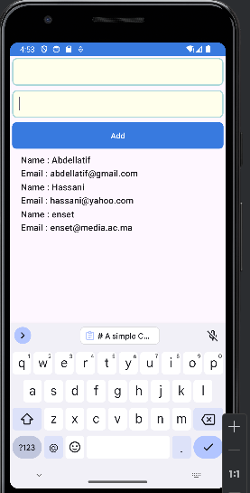

# Mobile Native Apps Repository

Welcome to the Mobile Native Apps repository! This repository hosts a collection of Android projects built using Java.

## Projects

### 1. Chat app : Interacting with an AI model

The app is a simple chatbot application for Android where users can exchange messages with a chatbot.

### 2. Calculator App
A simple calculator app built with Java.

### 3. List view
A simple List view app which dispalys a list of elements.

